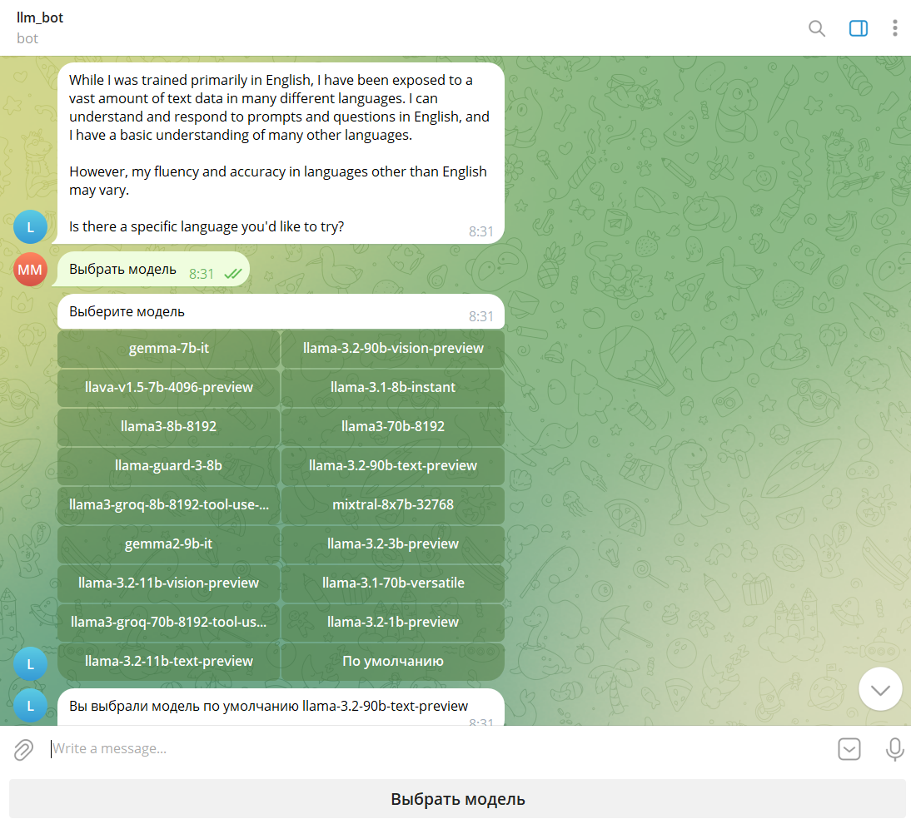

# Large-language model chatbot
## Telegram bot for interaction with Groq's large-language models written with aiogram, asyncio and other asynchronous libraries

This project is a chatbot designed for interaction with Large Language Models (LLMs) that are publicly available via the Groq API, enabling text generation and image processing.

The following instructions describe the bot's functionality:

To select a model, click the "Select Model" button.
To ask the language model a question, type your question in the input field.
To get a description of an image, send the image in the chat.
To get an answer to a question about an image, send the image to the chat and type your question in the Caption field.
To ask a question about an already sent image, use the /image ...your question... command (replace ...your question... with your text, without the dots).
The bot supports the following commands:

/help – Display the help menu.
/models – Get a list of available models.
/clear_history – Clear the message context, making previous interactions with the language model unknown.
/current_model – Display the currently selected language model.
/image [your question] – Ask a question about the most recently sent image in the chat.
To grant someone access to the bot, add their Telegram user ID to the allowed_users.txt file.
The bot restricts unauthorized users from accessing handlers by implementing middleware.

Scalability considerations:
The bot is containerized using Docker Compose to facilitate future scalability. This includes the potential addition of user management via a database or the integration of additional applications.

